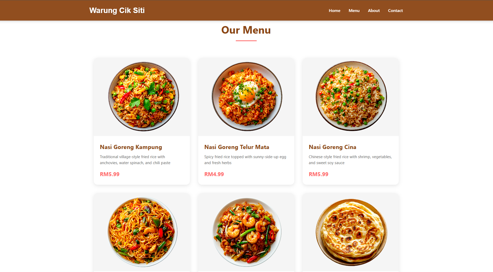

# Warung Cik Siti Website 🍜
A responsive website for a Malaysian restaurant featuring authentic local dishes. Built with HTML5, CSS3, and JavaScript.



## 🍱 Features
- Responsive design
- Mobile-friendly navigation
- Interactive menu display
- Contact form
- Smooth scroll navigation
- Image optimization
- Story section
- Contact information
- Modern UI/UX design

## 🛠️ Technologies Used
- HTML5
- CSS3
- JavaScript
- Custom assets
- Responsive design principles

## 📁 Project Structure
```
warung-cik-siti/
│
├── index.html
├── README.md
│
└── assets/
    ├── css/
    │   └── style.css
    ├── js/
    │   └── script.js
    └── img/
        ├── Nasi-Goreng-Kampung.png
        ├── Nasi-Goreng-Telur-Mata.png
        ├── Nasi-Goreng-Cina.png
        ├── Mee-Goreng-Mamak.png
        ├── Char-Kway-Teow.png
        ├── Roti-Canai.png
        └── restaurant-interior.jpg
```

## 🚀 Getting Started
1. Clone the repository:
```bash
git clone https://github.com/your-username/warung-cik-siti.git
```
2. Navigate to the project directory:
```bash
cd warung-cik-siti
```
3. Open `index.html` in your web browser or use a local server:
```bash
python -m http.server
```

## 🎨 Image Assets Requirements
### Menu Item Images
- Size: 400x300 pixels
- Type: Food photography
- Format: PNG with transparency
- Style: Consistent lighting and presentation

### Restaurant Interior
- Size: 600x400 pixels
- Type: Interior/exterior photography
- Format: JPG
- Style: Natural lighting, welcoming atmosphere

## 💻 Website Sections
- **Header**: Navigation and branding
- **Hero**: Welcome message and call-to-action
- **Menu**: Display of Malaysian dishes
- **About**: Restaurant story and philosophy
- **Contact**: Contact form and information
- **Footer**: Copyright and additional info

## 🔧 Customization
### Modifying Styles
You can adjust website styles in `assets/css/style.css`:
```css
/* Color scheme */
:root {
    --primary-color: #8B4513;
    --secondary-color: #ff6b6b;
    --background-color: #fff9f0;
    --text-color: #333;
}

/* Typography */
body {
    font-family: 'Segoe UI', sans-serif;
    line-height: 1.6;
}
```

## 📝 License
This project is open source

## 👏 Acknowledgments
- Malaysian cuisine inspiration
- Food photography
- Interior design photography


